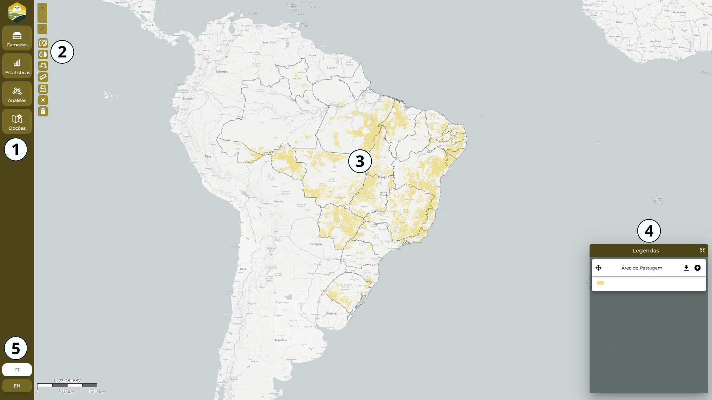
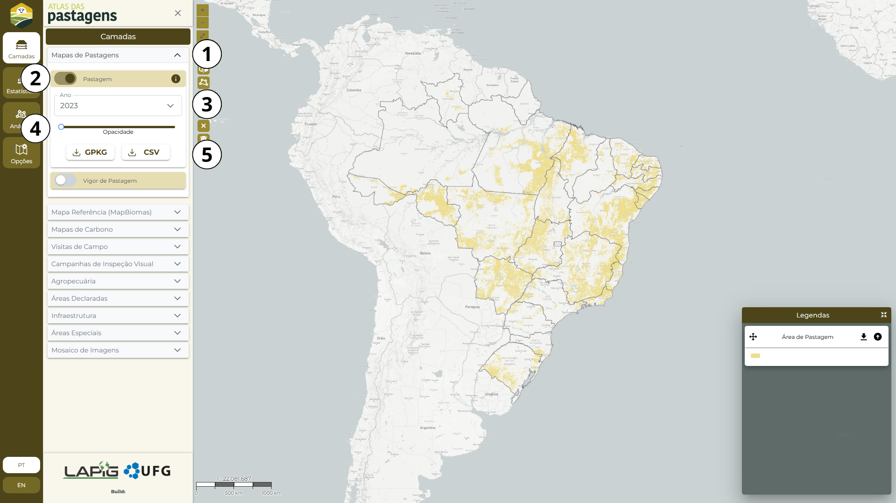
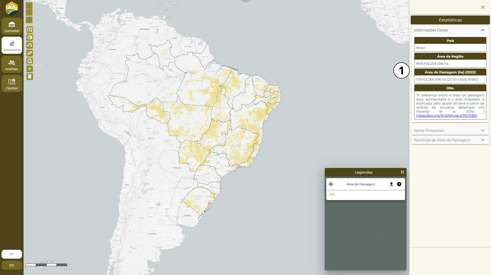
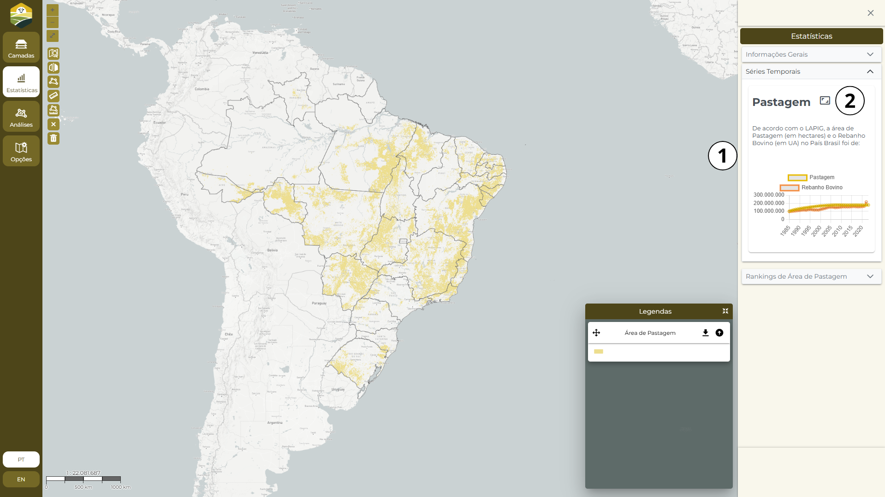
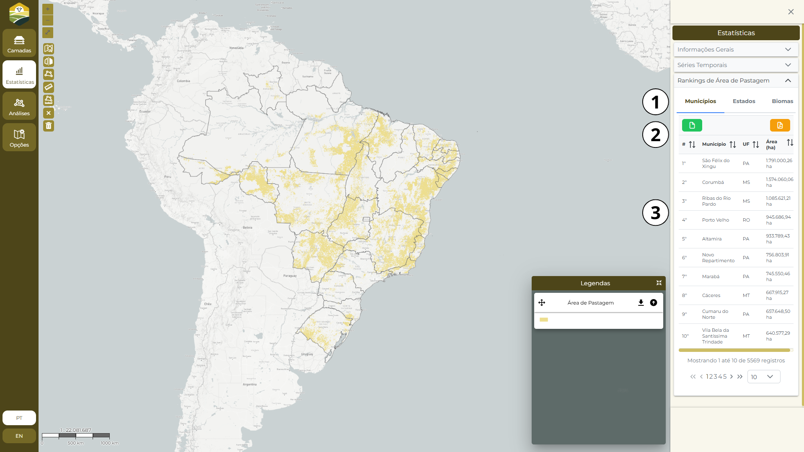
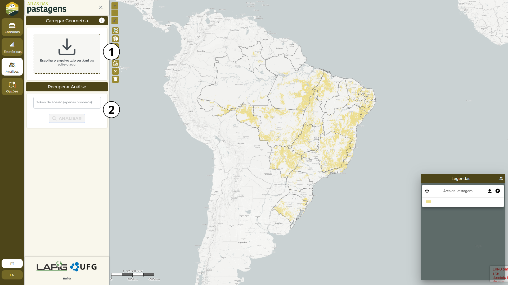
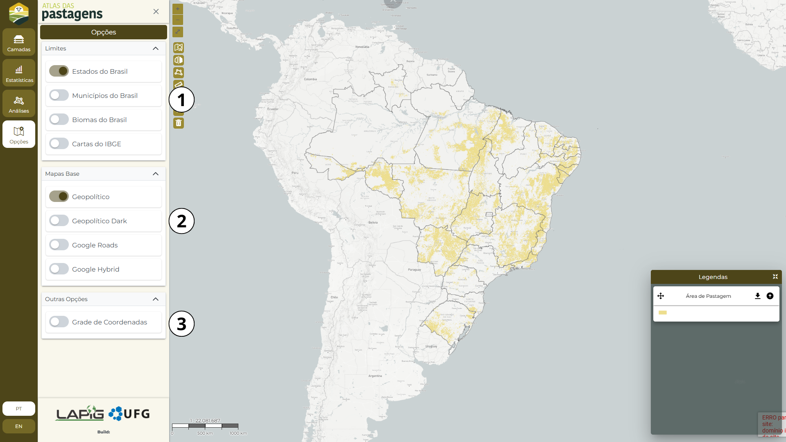
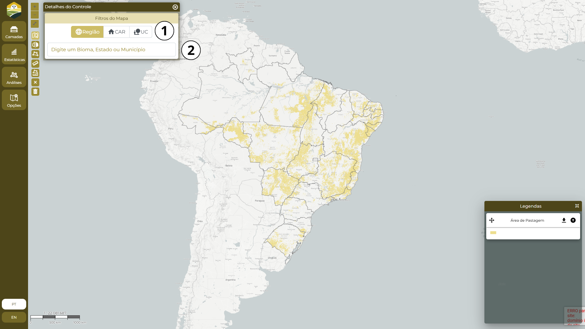

Exemplo: [URL](https://lapig-ufg.github.io/d-pat/)

# Guia de introdução

## Documentação Atlas das Pastagens

O Atlas das Pastagens é uma plataforma pública e gratuita desenvolvida pelo [Laboratório de Processamento de Images e Geoprocessamento da Universidade Federal de Goiás (LAPIG/UFG)](https://www.lapig.iesa.ufg.br/) da [Universidade Federal de Goiás](https://ufg.br/) (LAPIG/UFG). Seu principal objetivo é disponibilizar dados e informações sobre as áreas de pastagens no Brasil, auxiliando pesquisadores, gestores públicos, setor produtivo e a sociedade na compreensão da dinâmica dessas paisagens.

A plataforma foi criada no âmbito do Programa de Pesquisa em Pastagens (PPP) para tornar acessível os resultados e produtos, gerados no contexto da iniciativa [MapBiomas](https://brasil.mapbiomas.org/) e de outros projetos desenvolvidos no laboratório, reunindo um acervo abrangente de informações baseadas em sensoriamento remoto e dados oficiais. Entre os principais conjuntos de dados disponíveis, destacam-se:

* **Mapeamento da Extensão e Distribuição das Pastagens:** Permite acompanhar a evolução das áreas ocupadas por pastagens no Brasil ao longo do tempo.

* **Mapeamento do Vigor da Pastagem:** Indica a condição e vigor vegetativo (disponibilidade de biomassa) das pastagens, auxiliando na gestão e no planejamento do uso da terra.

* **Mapa Síntese de Pastagens:** Compila informações das áreas de pastagem no Brasil a partir de fontes como TerraClass Amazon, Funcate, PROBIO, Canasat e TNC. Foi fundamental para a distribuição de amostras para desenvolvimento dos primeiros mapeamentos do MapBiomas.

* **Estimativas de Estoques de Carbono no Solo:** Fornece dados sobre o carbono armazenado na camada superficial do solo (0-20 cm), contribuindo para estudos sobre o papel das pastagens no balanço de carbono e na sustentabilidade ambiental.

* **Dados de Campo:** Compila dados de campo coletados por especialistas sobre a condição e produtividade das pastasgens, oferecendo uma análise detalhada da saúde e do estado das pastagens.

* **Dados de Interpretação Visual:** Fornece séries temporais de Uso e Cobertura da Terra obtidos a partir de inspeção visual de imagens de satélite Landsat, que permitem acompanhar as mudanças na paisagem ao longo dos anos, revelando tendências e padrões de uso da terra.

* **Dados sobre o Rebanho Bovino Brasileiro:** Derivados das pesquisas do Instituto Brasileiro de Geografia e Estatística (IBGE), fornecem uma visão integrada da relação entre pecuária e uso da terra.

* **Camadas Complementares de Informações Territoriais:** Incluem registros do Cadastro Ambiental Rural (CAR), reservas legais, infraestrutura agrícola (estradas, armazéns, frigoríficos), terras indígenas, unidades de conservação e assentamentos rurais, oferecendo um contexto espacial abrangente.

Esta documentação tem como objetivo apresentar a arquitetura da plataforma e detalhar suas bases de dados, metodologias e aplicações. A informação aqui registrada pode apoiar decisões futuras sobre a continuidade da plataforma e possíveis alternativas para a disponibilização dos dados.

A documentação está organizada em seções para facilitar o acesso às informações. Você pode utilizar o menu lateral para navegar pelos tópicos ou usar a função de busca para encontrar conteúdos específicos.

Caso tenha dúvidas ou precise de suporte, entre em contato com a equipe do LAPIG/UFG:

<!-- TODO: Melhorar... Disposição dos dados de contatos muito feia. -->
> Lapig - Laboratório de Sensoriamento Remoto e Geoprocessamento
Campus Samambaia, Almeida Palmeiras, s/n - Chácaras Califórnia. 
CEP 74001-970 Goiânia - Goiás - Brasil.
lapigcoordenacao@gmail.com
nathalia.teles@ufg.br
+55 (62) 99555-3845

Explore a documentação e aproveite os dados e insights oferecidos pelo Atlas das Pastagens!

## Manual do Usuário

### Introdução

Este manual fornece instruções detalhadas sobre a utilização do Atlas das Pastagens, uma plataforma de acesso público que disponibiliza dados geoespaciais sobre as áreas de pastagens no Brasil. Aqui, você aprenderá a acessar e interpretar as informações da plataforma, explorar as bases de dados e compreender a metodologia por trás das camadas disponibilizadas.

### Acessando a Plataforma

A plataforma está disponível no site oficial [Atlas das Pastagens](https://atlasdaspastagens.ufg.br/).

> *Requisitos*: Utilize um navegador moderno com suporte a JavaScript para acessar todas as funcionalidades da plataforma.

### Principais Funcionalidades

O Atlas das Pastagens oferece um conjunto abrangente de ferramentas para explorar e analisar dados geoespaciais sobre pastagens no Brasil. Com um sistema interativo de mapas, permite visualizar, analisar e baixar informações essenciais para pesquisas científicas, gestão ambiental e tomada de decisões estratégicas.

A plataforma proporciona uma experiência interativa e intuitiva com os mapas, permitindo:











* **Gerenciamento de Camadas:** Ativar ou desativar camadas de informação para personalizar a visualização e focar em dados específicos.
Exploração de Metadados: Acessar metadados detalhados para cada camada geoespacial, garantindo transparência e compreensão da origem e qualidade dos dados.

* **Análise Espacial:** Realizar medições de área e distância, explorar a distribuição espacial dos dados e filtrar regiões específicas. Os dados do Atlas das Pastagens estão disponíveis para download em diversos formatos, facilitando sua integração em outras plataformas e softwares de análise:
    * *Formatos Vetoriais:* Geopackage (.GPKG), Shapefile (.SHP) e/ou CSV.
    * *Formato Matricial (raster):* Tag Image File Format (.TIF).

Cada camada geoespacial conta com metadados detalhados, incluindo origem dos dados, metodologia aplicada, resolução espacial e temporal, fonte (LAPIG, MapBiomas, IBGE, entre outros) e sistema de referência cartográfico. Esses metadados garantem a rastreabilidade, a qualidade e a precisão das informações disponibilizadas, permitindo aos usuários avaliar a adequação dos dados para seus propósitos específicos.

### Como citar o Atlas das Pastagens?

Nossos produtos ainda não possuem um DOI, para citação dos bancos de dados disponíveis no Atlas das Pastagens sugerimos utilizar os artigos publicados acerca de cada mapeamento:

* **Mapas de pastagens:** https://doi.org/10.1016/j.rse.2019.111301

* **Mapas de qualidade das pastagens:** https://doi.org/10.3390/rs14041024

* **Mapas de carbono:** https://doi.org/10.21203/rs.3.rs-1769589/v1

Para referência da plataforma em si recomendamos utilizar o modelo de citação dos sites segundo o guia de normalização bibliográfica da sua universidade ou revista de publicação, a exemplo:

> LAPIG. Atlas Digital das Pastagens Brasileiras. 2020. Available online: https://atlasdaspastagens.ufg.br/ (accessed on 22 july 2022). 

No caso das citações diretas e indiretas usar o nome dos autores dos referidos artigos ou Lapig, 2022 (caso use a plataforma como referência). 

## Dados Geográficos

<!-- TODO: Terminar essa seção. -->

<!-- Exemplo:

| Dados | Descrição | Data | Escala | Fonte |
|:-|:-|:-:|:-:|:-:|
| Exemplo 1 | Descrição do exemplo 1 | 2020 | 1:250.000 | Inpe |
| Exemple 2 | Descrição do exemplo 2 | 2000 - 2024 | 1:125.000 | Inpe |

-->

### Mapas de Pastagem

| Dados | Descrição | Data | Escala | Fonte |
|:-|:-|:-:|:-:|:-:|
| Pastagem | ... | 1985 - 2023 | ... | ... |
| Vigor de Pastagem | ... | 2000 - 2023 | ... | ... |

### Mapa Referência

| Dados | Descrição | Data | Escala | Fonte |
|:-|:-|:-:|:-:|:-:|
| Referência Pastagem | ... | ... | ... | ... |

### Mapas de Carbono

| Dados | Descrição | Data | Escala | Fonte |
|:-|:-|:-:|:-:|:-:|
| Estoque de Carbono | ... | 1985 - 2020 | ... | ... |

### Visitas de Campo

| Dados | Descrição | Data | Escala | Fonte |
|:-|:-|:-:|:-:|:-:|
| Visita de Campo Goiás | ... | 2022 | ... | ... |
| Visita de Campo Amazonia Portal | ... | 2022 | ... | ... |
| Visita de Campo Mato Grosso | ... | 2022 | ... | ... |
| Visita de Campo Pontos Antigos - Com Parada | ... | ... | ... | ... |
| Visita de Campo Pontos Antigos - Sem Parada | ... | ... | ... | ... |

### Campanhas de Inspeção Visual

| Dados | Descrição | Data | Escala | Fonte |
|:-|:-|:-:|:-:|:-:|
| Mapbiomas col.3 | ... | 1985 - 2017 | ... | ... |
| Mapbiomas Classes Raras | ... | 2019 | ... | ... |
| Mapbiomas col.6 | ... | 2020 | ... | ... |

### Agropecuária

| Dados | Descrição | Data | Escala | Fonte |
|:-|:-|:-:|:-:|:-:|
| Rebanho Bovino em Unidaddes Animal (UA) | ... | 1985 - 2022 | ... | ... |
| Rebanho Bovino em Nº de Cabeças (Kbcs) | ... | 1985 - 2022 | ... | ... |
| Floresta Plantada - Mapbiomas | ... | ... | 1985 - 2020 | ... |
| Lavoura Perene | ... | 1985 - 2020 | ... | ... |
| Lavoura Temporária | ... | 1985 - 2020 | ... | ... |

### Áreas Declaradas

| Dados | Descrição | Data | Escala | Fonte |
|:-|:-|:-:|:-:|:-:|
| CAR - Prop. Rurais | ... | ... | ... | ... |
| Reserva Legal | ... | ... | ... | ... |
| Planejamento Hídrico | ... | ... | ... | ... |

### Infraestrutura

| Dados | Descrição | Data | Escala | Fonte |
|:-|:-|:-:|:-:|:-:|
| Malha Viária - Rodovias - DNIT | ... | ... | ... | ... |
| Malha Viária - Vias Detalhadas - OSM | ... | ... | ... | ... |
| Malha Viária | ... | ... | ... | ... |
| Armazéns | ... | ... | ... | ... |
| Frigorifios | ... | ... | ... | ... |

### Áreas Especiais

| Dados | Descrição | Data | Escala | Fonte |
|:-|:-|:-:|:-:|:-:|
| Terrars Indigenas | ... | ... | ... | ... |
| Assentamentos | ... | ... | ... | ... |
| Comunidades Quilombolas | ... | ... | ... | ... |
| Unidades de Conservação - Proteção Integral | ... | ... | ... | ... |
| Unidades de Conservação - Uso Sustentável | ... | ... | ... | ... |
| Áreas Militares | ... | ... | ... | ... |
| Áreas Públicas Não-Destinadas | ... | ... | ... | ... |
| Comunidades Quilombolas | ... | ... | ... | ... |

### Mosaico de Imagens

| Dados | Descrição | Data | Escala | Fonte |
|:-|:-|:-:|:-:|:-:|
| Satélite | ... | ... | ... | ... |

## Métricas de Qualidade

Métricas de qualidade...

### Processos de Validação

#### Campo

Durante a vigência do projeto...

#### Validação

Duas superfícies de susceptibilidade...

### Análise Automáticas

# ARQUITETURA DE SOFTWARE

## Visão Geral

A arquitetura de software desenvolvida para o Atlas das Pastagens pode ser observada na Figura abaixo.

### Componentes de Software

A arquitetura de software desenvolvida para o Atlas das Pastagens pode ser observada na Figura abaixo.


Essencialmente, pode-se dividir o Atlas das Pastagens em três partes:

- **Client**: Responsável por apresentar toda a interface, construído em Angular 16 com apoio dos frameworks:

    - OpenLayers: Exibir e manipular mapas interativos.

    - PrimeNG: Componentes visuais (UI).

- **Server**: Disponibiliza os serviços que compõem a aplicação:

    - Application Server: Disponibiliza o acesso aos dados do Data Source, análises e configurações.

    - Assets Server: Disponibiliza o acesso aos assets que compõe

    - Storage Server: 

    - [OWS Server](../ows-server/ows-server.md): Disponibiliza o acesso ao MapServer, responsável pelo processamento dos dados geográficos, apresentação visual dos mesmos e gerenciamento de cache das imagens geradas.

- **Data Source**: Responsável por armazenar os dados vetoriais e matriciais.

Resumidamente, todos os dados usados pelo Atlas das Pastagens estão organizados em bancos de dados, PostgreSQL e MongoDB, e arquivos de repositórios gerenciados pelo MINIO. O PostgreSQL utiliza a extensão PostGIS que permite processar consultas espaciais via Structured Query Language (SQL). Já os dados que não necessitam de cruzamentos espaciais são armazenados em arquivos nos formatos Shapefile e/ou GeoTIFF. Assets utilizados pelo hotsite, como fotos de perfil e descrições da equipe, são armazenados pelo MINIO e manipulados pelo Voyager.

Estes dados são acessados pelo Application Server e pelo MINIO e são disponibilizados através de URLs com requisições por meio do protocolo HTTP. Todas as requisições Web realizadas aos Servers são interceptadas pelo Apache Server e devidamente redirecionadas. Desta forma, o Client realiza todas as requisições necessárias para construir a visualização dos elementos da página, tais como: mapa interativo, gráficos, campo de busca e etc.

Por fim, destaca-se que todos o código-fontes foram disponibilizado publicamente no Github do LAPIG/UFG.

## Servidor de Aplicação

Basicamente o Atlas das Pastagens é dividido em duas partes: Client e Application Server, conforme descrito anteriormente. O código-fonte para estas duas partes está hospedado no respositório Github do projeto.

Dentro do repositório do projeto, o código-fonte do Application Server está no diretório `./server`. Por ser construído em NodeJS, ao clonar o projeto o usuário deverá navegar até a pasta server e instalar as dependências gerenciadas pelo Node Package Manager (NPM) através do comando:

```shell
npm install
```

Em seguida, deve-se copiar o arquivo .env.exemple renomeando-o para .env:

```shell
cp .env.exemple .env
```

Em seguida, deve-se alterar o arquivo .env com as devidas configurações e parâmetros referentes ao banco de dados, pastas para armazenamento dos arquivos de Upload e Download e endereço de hospedagem do OWS Server.

Deve-se ainda, criar as pastas de upload com os seguintes comandos:

```shell
mkdir -p /home/tiago/Documentos/LAPIG/atlas-pastagens/server/plataforms_files/atlas-pastagens-files/uploads/
```

A fim de facilitar a execução do Application Server foi desenvolvido um script nomeado `start.sh` localizado na raiz da pasta `./server`. Portanto, basta realizar a execução deste arquivo para inicializar o Application Server. A fim de identificar modificações em tempo real, o Application Server faz uso da biblioteca `always`, portanto talvez seja necessário a instalação da mesma através do comando.

```shell
sudo npm install always -g
```

Após a instalação do always, pode-se inicializar o Application Server através do comando:

```shell
./src/server/start.sh
```

### Middleware para manipulação do Banco de Dados

Para facilitar a criação de serviços que fazem uso de consultas ao banco de dados foi criado um middleware nomeado `dataInjector.js` que cria um pool de conexões para execução de diversas queries simultâneas.

O `dataInjector.js` analisa a URL da requisição HTTP de modo a associar a função que especifica a query (por meio da tupla {id, sql}) com o controlador que irá devolver a resposta da requisição.

Portanto, todas as URLs deverão ser criadas no seguinte padrão:

```javascript
'/service/<nome_arquivo_js_com_query>/<nome_funcao_executada>'
```

### Como criar um novo serviço

O *Application Server* possui três pastas que armazenam os principais arquivos que permitem a disponibilização de um novo serviço ao Atlas das Pastagens: 

1. **Controller:**: Os arquivos nesta pasta são responsáveis por processar implementar a lógica da tarefa passada pela requisição HTTP.

2. **Database**: Os arquivos nesta pasta são responsáveis por implementar os métodos com as *queries* a serem executadas no banco de dados. Devido a estrutura do `dataInjector.js`, mais de uma *query* poderá ser executada durante uma mesma requisição.

3.  **Routes**: Os arquivos desta pasta são os responsáveis por criar as URLs de acesso *(endpoint)* a um serviço, apontar qual o controlador deverá processar a lógica para a requisição e, caso necessário, injetar o acesso ao banco de dados.

Portanto, supondo que queremos criar um novo serviço para retornar o municpípio com a maior área de pastagem pertencente à tabela *pasture_col9_s100*:

    server/routes/example.js
``` js
module.exports = function (app) {

	var dataInjector = app.middleware.dataInjector
	var example = app.controllers.examplecontroller;

	app.get('/service/examplequery/largest', dataInjector, example.largest);

}
```

Após a criação do *endpoint* de acesso, basta criar o arquivo com as funções desta classe de *queries* (`examplequery.js`) e a função (`Query.largest`) que irá executar a *query* especificada. Vale ressaltar que deverá ser passado um parâmetro pela requisição, o **year**, que indicam de qual ano o usuário quer encontrar.

    server/database/queries/examplequery.js
``` js
module.exports = function (app) {

    var Query = {};
    
    Query.largest = function (params) {

        year = params['year'];
    
        return [{
                id: 'largest_id',
                sql: `SELECT estado, MAX(area_ha) AS max_area FROM pasture_col9_s100 WHERE year = ${year} and bioma='Cerrado' GROUP BY estado ORDER BY max_area DESC LIMIT 1;`
            }]
        };

        return Query;
    }
```

Após a construção do método e a *query*, basta criar o controlador `examplecontroller.js` para receber a requisição, realizar a chamada ao método para execução da *query*, coletar o resultado e enviar como resposta da requisição.

    server/controllers/examplecontroller.js
``` js
module.exports = function (app) {

    const config = app.config;
    
	var Controller = {}

	Controller.largest = function (request, response) {

		var queryResult = request.queryResult['largest_id']

		response.send(queryResult)

        response.end()

    }
    
    return Controller;
}
```

Por fim, este por se tratar de uma requisição HTTP do tipo `GET`, a mesma poderá ser acessada via navegador. Considerando que o server está executando em `localhost:3000` e o usuário deseja encontrar o município com maior area de pastagem de acordo com a Coleção 9 em 2020, a URL de acesso ficará da seguinte forma: 

``` url
http://localhost:3000/service/examplequery/largest?year=2020
```

Além de requisitar pelo navegador, o serviço também poderá ser requisitado pelo *Client* a fim de disponibilizar este dado na plataforma Atlas das Pastagens. Para tal, o mesmo poderá ser feito via biblioteca [HttpClient](https://angular.io/api/common/http/HttpClient) do Angular e assim obter o arquivo JSON com os dados processados. Considerando que a variável `http` foi devidadmente injetada no construtor da classe do Angular, o serviço `ExampleService` abaixo deverá realizar a requisição e retornar um *Observable* que poderá ser utilizado pela plataforma para obtenção dos dados:

    client/src/app/@core/services/example.service.ts
``` js
import { Injectable } from '@angular/core';
import { Observable } from 'rxjs';
import { HttpClient, HttpHeaders } from '@angular/common/http';
import { map } from "rxjs/operators";

export { HttpService };

@Injectable({
  providedIn: 'root'
})
class ExampleService {
    private apiURL = '/service/examplequery/largest';

    constructor(private httpClient: HttpClient) {}

    getData(year: int): Observable<any> {
        return this.httpClient.post<any>(this.apiURL, {
            headers: new HttpHeaders({
            'year': recaptcha,
            }),
        })
        .pipe(map(response => JSON.parse(response.data)));
    }
}
```
